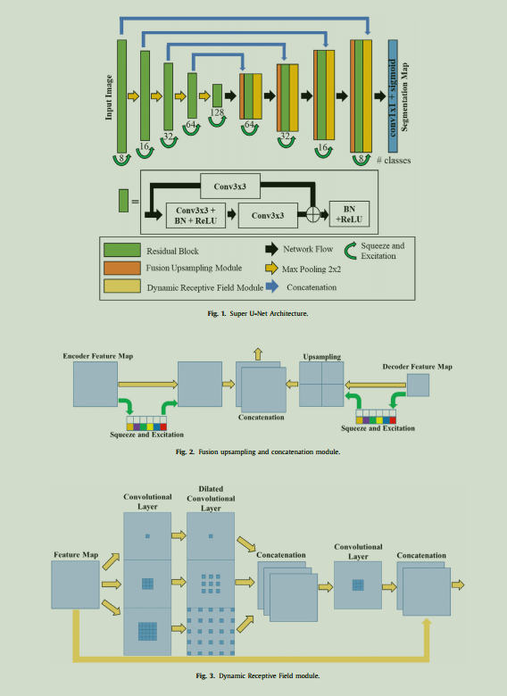
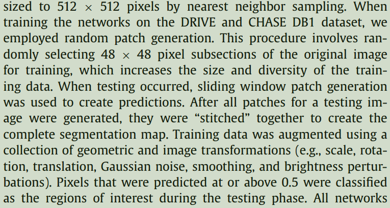

# SuperUNET: A modularized generalizable architecture


SuperUNET is a modification of UNET and it integrates a dynamic receptive field module and a fusion upsampling module into the classical U-Net architecture. The model was developed and tested to segment retinal vessels, gastrointestinal (GI) polyps, skin lesions on several image types (i.e., fundus images, endoscopic images, dermoscopic images). Upsampled fusion and dynamic receptive fields are two mechanisms that attempt to extract and retain significant features, which ensures that meaningful features are leveraged for the segmentation map.
For details see the [paper](https://europepmc.org/backend/ptpmcrender.fcgi?accid=PMC9070860&blobtype=pdf)

## Getting Started

### Prerequisites
For packages see, env.yml, 
```bash
conda env create -f env.yml
conda activate pytorch
```

### Installations
Clone the repo
```bash
git clone https://github.com/ursaj123/SuperUNET.git
cd SuperUNET
```

### Data
Download the data from [kaggle](https://www.kaggle.com/datasets/andrewmvd/drive-digital-retinal-images-for-vessel-extraction/code) and put it in a folder named data.
```bash
tar -xf archive.zip
```

Training set contains 40 train images, out of which 30 are used for training and rest for testing, the data augmentations techniques and the way these images are used as mentioned are - 



### Training
Training SuperUNET
```bash
python train.py --images_path data/DRIVE --split_ratio 0.7 --lr 0.001 --epochs 20 --amp False --gradient_clip 5.0 --early_stopping 5 --weights 1,4 --scheduler True
```

See the config in [train.py](train.py) for more options in the training script.


### Directory Structure
After training your directory structure should look like this:
```bash
SuperUNET
├── data
│   ├── DRIVE
│   │   ├── test
│   │   │   ├── 1st_manual
│   │   │   ├── images
│   │   ├── training
│   │   │   ├── 1st_manual
│   │   │   ├── images
│   │   │   ├── mask
├── all_expts
│   ├── expt_name
│   │   ├── logs
│   │   ├── models
│   │   ├── test_images
│   │   ├── config.json
```


### Testing
See the [inferenece notebook](inference.ipynb) for testing the model on new images.


